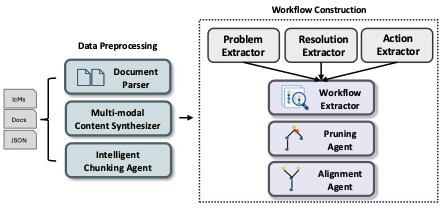

# GraphMind Artifact (CIKM 2026)

Reproducibility artifact for the CIKM 2026 submission:

> *GraphMind: From Operational Traces to Self-Evolving Workflow Automation*

This repository contains the **offline workflow-extraction pipeline** described in Section 3 of the paper — the system that converts raw incident management tickets (ICMs), documentation, and structured logs into pruned, aligned **workflow graphs** that downstream agents can search and execute.

## Pipeline overview



The pipeline runs in two stages (paper §3.1–3.3):

1. **Data Preprocessing** — heterogeneous inputs (ICMs, docs, JSON) are parsed, multi-modal content (screenshots, embedded tables) is synthesized into text, and the resulting transcript is chunked into LLM-sized windows by an intelligent chunking agent.
2. **Workflow Construction** — three parallel extractors (Problem, Resolution, Action) feed a Workflow Extractor that assembles `problem → action → observation → … → cause/resolution` chains. A Pruning Agent removes duplicate or low-quality paths, and an Alignment Agent merges semantically equivalent branches across incidents.

## Repository layout

```
artifact/
├── README.md                    # this file
├── LICENSE                      # MIT
├── graphmind_pipeline.ipynb     # end-to-end runnable notebook (entry point)
│
├── graphmind/                   # minimal runnable package
│   ├── pipeline.py              # PocketFlow Flow assembly (paper Fig. 3)
│   ├── nodes.py                 # 11 PocketFlow Nodes — one per pipeline stage
│   ├── postprocess.py           # action resolution, mitigation injection, labeling
│   ├── llm_client.py            # Azure OpenAI client wrapper
│   ├── text_utils.py            # tokenization, JSON extraction, image handling
│   └── extractor.py             # high-level entry point: extract_taxonomy_from_dict()
│
├── prompts/                     # 11 LLM prompts (one .md file per stage)
│   ├── 01_remove_tables.md             # §3.1 Document Parser
│   ├── 02_image_analyzer.md            # §3.1 Multi-modal Content Synthesizer
│   ├── 03_decode_adx_link.md           # §3.1 Intelligent Chunking Agent (KQL URL helper)
│   ├── 04_find_text_between_actions.md # §3.1 Intelligent Chunking Agent (text span helper)
│   ├── 05_incident_summary.md          # §3.2 Problem Extractor
│   ├── 06_extract_actions_chunk.md     # §3.2 Action Extractor
│   ├── 07_extract_results_chunk.md     # §3.2 Resolution Extractor
│   ├── 08_extract_taxonomy.md          # §3.2 Workflow Extractor
│   ├── 09_is_semantically_similar.md   # §3.3 Alignment Agent (similarity oracle)
│   ├── 10_taxonomy_retry.md            # §3.2 Workflow Extractor (coverage repair)
│   └── 11_gen_labels_for_taxonomy.md   # §3.3 Pruning Agent (label generation)
│
├── data/                        # two anonymized incidents for end-to-end runs
│   ├── test_input_A.json        # connectivity-security incident
│   └── test_input_B.json        # client-experiences incident
│
└── outputs/                     # reference taxonomies produced by the notebook
    ├── taxonomy_A.json
    └── taxonomy_B.json
```

Each prompt file in `prompts/` documents its template variables, the calling Node in `graphmind/nodes.py`, and the corresponding paper agent.

## Running the pipeline

The notebook `graphmind_pipeline.ipynb` is the canonical entry point. It runs the full pipeline on both test inputs and writes the resulting taxonomies to `outputs/`.

```bash
# 1. install
pip install -r requirements.txt    # pocketflow, openai, jupyter, nbformat

# 2. configure Azure OpenAI (or set GRAPHMIND_USE_AZURE=0 for openai.com)
export AZURE_OPENAI_ENDPOINT="https://<your-resource>.openai.azure.com/"
export AZURE_OPENAI_API_KEY="..."
export AZURE_OPENAI_DEPLOYMENT="gpt-5.2"
export AZURE_OPENAI_API_VERSION="2024-12-01-preview"
export GRAPHMIND_USE_AZURE=1

# 3. run
jupyter nbconvert --to notebook --execute graphmind_pipeline.ipynb \
    --output graphmind_pipeline.executed.ipynb
```

To run programmatically:

```python
from graphmind.extractor import extract_taxonomy_from_dict
import json

incident = json.load(open("data/test_input_A.json"))
taxonomy = extract_taxonomy_from_dict(incident, domain="CloudDw")
```

## Reproducibility notes

- All names, team names, cluster/database identifiers, and internal URLs in `data/`, `outputs/`, `prompts/`, and the notebook have been **anonymized** with a deterministic literal-string map. The reference taxonomies were re-extracted post-anonymization with `gpt-5.2`.
- LLM outputs are non-deterministic; node counts and exact phrasings will vary between runs. The pipeline's structural invariants (every action appears in the chain, each action is preceded by a problem or observation, etc.) are enforced by the Workflow Extractor's retry loop (`prompts/10_taxonomy_retry.md`).
- The pipeline is **stateless** at the incident level — there is no shared store across runs, so each incident produces an independent taxonomy. Cross-incident merging is the Alignment Agent's job (paper §3.3) and is exercised in the notebook's final cells.

## License

Community Data License Agreement — see [`LICENSE`](LICENSE).
